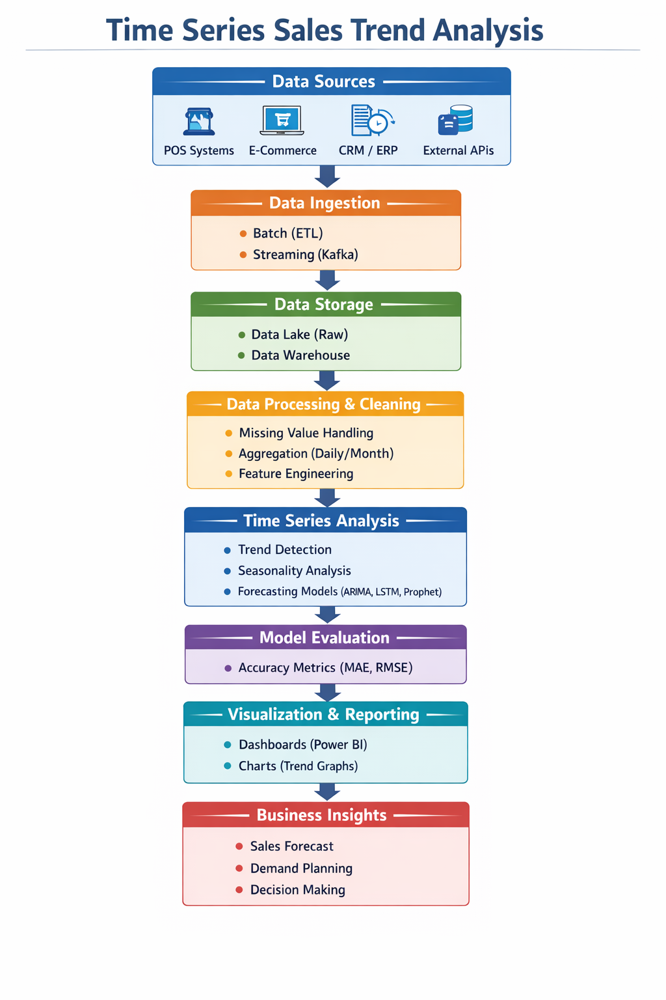
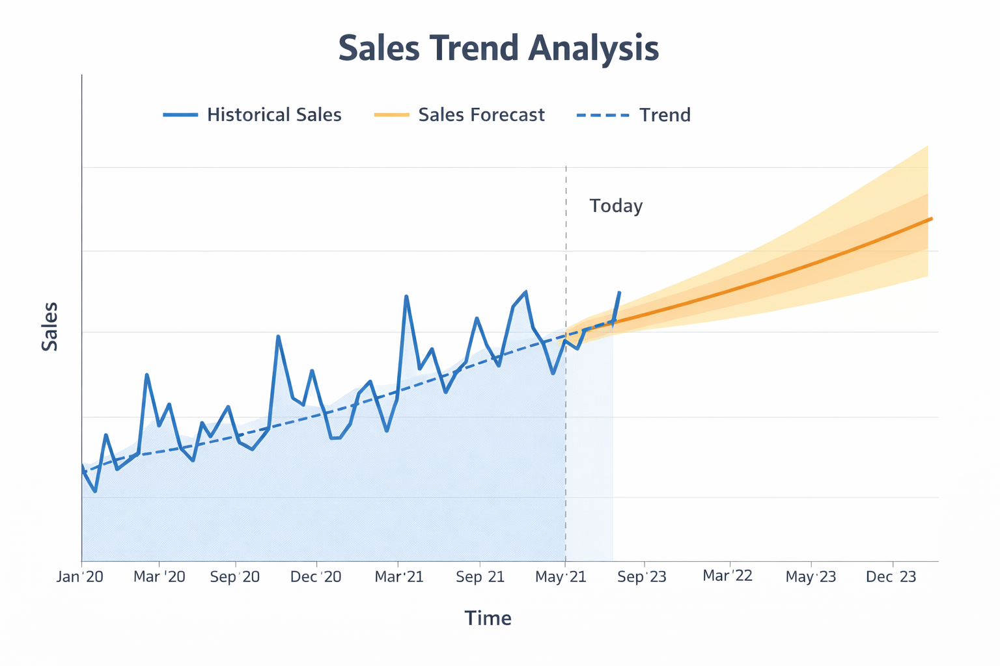
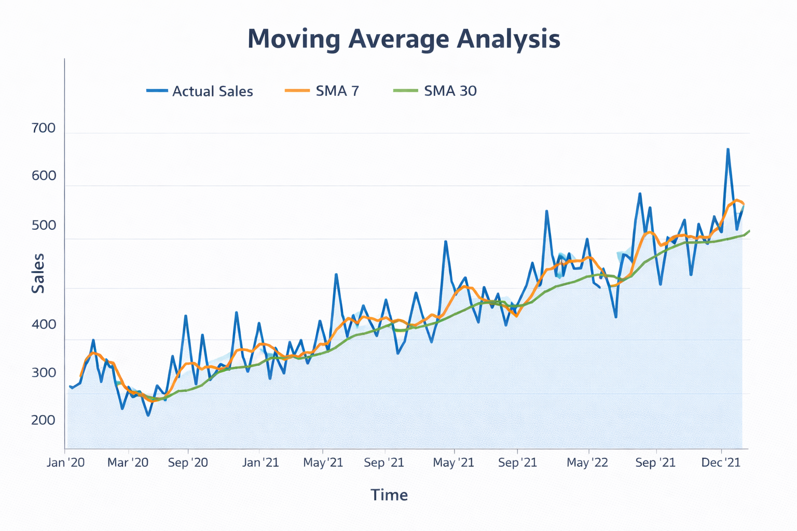

# Time Series Sales Trend Analysis

## Introduction
This project analyzes historical sales data to identify trends and forecast future sales.

## Objectives
- Analyze sales data
- Identify trends
- Detect seasonal patterns
- Forecast future sales

## Architecture Diagram

## Sales Trend

## Moving Average

## Technologies Used
- Python
- Pandas
- NumPy
- Matplotlib

## How to Run
1. Install libraries
2. Run sales_analysis.py
3. View graphs

## Output
Shows:
- Sales trend
- Moving average
- Summary statistics
